# Domain Model

## Overview
The domain is organized around gateways and a three-layer metric pyramid.

## Entities
### Gateway
A gateway is a top-level scope representing a group, team, or community.
Fields:
- `id`
- `name`
- `type` (`group`, `team`, `community`)
- `owner_id`
- `members`
- `status`
- `created_at`
- `updated_at`

### MetricDefinition
Defines a metric in the hierarchy.
Fields:
- `id`
- `gateway_id`
- `name`
- `description`
- `layer` (`1`, `2`, or `3`)
- `parent_metric_id`
- `code`
- `unit`
- `weight`
- `aggregation_method`
- `source_type`
- `is_fixed`
- `is_active`

### MetricValue
Stores values for a metric over time.
Fields:
- `id`
- `metric_definition_id`
- `period_start`
- `period_end`
- `value`
- `confidence`
- `status`
- `computed_at`
- `computed_by`

### DataSource
Represents how a Layer 3 metric is fed.
Fields:
- `id`
- `metric_definition_id`
- `type` (`manual`, `api`, `excel`, `sql`, `derived`)
- `name`
- `config`
- `last_sync_at`
- `status`

### MetricRelation
Represents parent-child metric links.
Fields:
- `id`
- `parent_metric_id`
- `child_metric_id`
- `relation_type`
- `weight`
- `sort_order`

### CalculationRun
Tracks recalculation events.
Fields:
- `id`
- `gateway_id`
- `trigger_type`
- `started_at`
- `finished_at`
- `status`
- `error_message`

## Metric Hierarchy Rules
- There are exactly 6 Layer 1 metrics.
- Each Layer 1 metric has exactly 6 Layer 2 metrics.
- Each Layer 2 metric has at least 1 Layer 3 metric.
- Layer 3 metrics are leaf nodes and do not have children.
- Layer 2 metrics aggregate Layer 3 metrics.
- Layer 1 metrics aggregate Layer 2 metrics.

## Value Propagation Rules
- Layer 3 is the input layer.
- Layer 2 is the intermediate aggregation layer.
- Layer 1 is the top summary layer.
- Every computed value should retain lineage back to its inputs.
- Manual values are allowed only where the metric definition permits them.

## Formula Rules
Supported formula types:
- sum,
- average,
- weighted average,
- ratio,
- percentage,
- custom expression.

Each metric should store:
- formula type,
- input set,
- normalization rules,
- rounding rules,
- threshold rules if needed.

## Mermaid Diagram

```mermaid
flowchart TB
  G[Gateway: Group / Team / Community]

  subgraph L1[Layer 1 - 6 fixed top metrics]
    L1A[Metric 1]
    L1B[Metric 2]
    L1C[Metric 3]
    L1D[Metric 4]
    L1E[Metric 5]
    L1F[Metric 6]
  end

  subgraph L2[Layer 2 - 6 metrics under each Layer 1 metric]
    A1[1.1]
    A2[1.2]
    A3[1.3]
    A4[1.4]
    A5[1.5]
    A6[1.6]
    B1[2.1]
    B2[2.2]
    B3[2.3]
    B4[2.4]
    B5[2.5]
    B6[2.6]
    C1[3.1]
    C2[3.2]
    C3[3.3]
    C4[3.4]
    C5[3.5]
    C6[3.6]
    D1[4.1]
    D2[4.2]
    D3[4.3]
    D4[4.4]
    D5[4.5]
    D6[4.6]
    E1[5.1]
    E2[5.2]
    E3[5.3]
    E4[5.4]
    E5[5.5]
    E6[5.6]
    F1[6.1]
    F2[6.2]
    F3[6.3]
    F4[6.4]
    F5[6.5]
    F6[6.6]
  end

  subgraph L3[Layer 3 - unlimited input metrics]
    X1[Input]
    X2[Input]
    X3[Input]
    X4[Input]
    X5[Input]
    X6[Input]
    X7[Input]
    X8[Input]
    X9[Input]
  end

  G --> L1
  L1A --> A1 --> X1
  L1A --> A2 --> X2
  L1A --> A3 --> X3
  L1A --> A4 --> X4
  L1A --> A5 --> X5
  L1A --> A6 --> X6

  L1B --> B1 --> X1
  L1B --> B2 --> X2
  L1B --> B3 --> X3
  L1B --> B4 --> X4
  L1B --> B5 --> X5
  L1B --> B6 --> X6

  L1C --> C1 --> X1
  L1C --> C2 --> X2
  L1C --> C3 --> X3
  L1C --> C4 --> X4
  L1C --> C5 --> X5
  L1C --> C6 --> X6

  L1D --> D1 --> X4
  L1D --> D2 --> X5
  L1D --> D3 --> X6
  L1D --> D4 --> X7
  L1D --> D5 --> X8
  L1D --> D6 --> X9

  L1E --> E1 --> X1
  L1E --> E2 --> X2
  L1E --> E3 --> X3
  L1E --> E4 --> X7
  L1E --> E5 --> X8
  L1E --> E6 --> X9

  L1F --> F1 --> X1
  L1F --> F2 --> X2
  L1F --> F3 --> X3
  L1F --> F4 --> X4
  L1F --> F5 --> X8
  L1F --> F6 --> X9
```

## Example Aggregation Chain
- A Layer 3 manual entry of attendance may feed a Layer 2 engagement metric.
- That Layer 2 engagement metric may combine with other Layer 2 metrics to produce a Layer 1 health score.
- The same Layer 3 input can contribute to multiple Layer 2 metrics if the rules allow it.

## Validation Rules
- A Layer 1 metric must always have exactly 6 Layer 2 children.
- A Layer 2 metric must have at least 1 Layer 3 child.
- A Layer 3 metric must not have children.
- Metric codes must be unique within a gateway.
- Values must match the unit and scale of the metric.

## Changelog
- v1: initial domain model and metric pyramid draft.